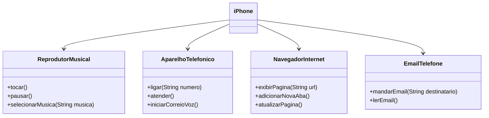

# IPhoneUML

## Autores
- [Eduardo F. Camargo](https://github.com/duducamargo)

## POO - Desafio

### Modelagem e Diagramação de um Componente iPhone

Neste projeto, meu objetivo foi modelar e diagramar as funcionalidades do componente iPhone, incluindo um Reprodutor Musical, Aparelho Telefônico, Navegador na Internet e um Email, baseando-me no vídeo de lançamento do iPhone de 2007.

#### Contexto
O anúncio do primeiro iPhone em 2007 foi revolucionário, marcando um ponto de virada na história da tecnologia. Introduzindo uma combinação inovadora de telefone, e-mail, iPod e navegador Safari em um único dispositivo, o iPhone redefiniu a maneira como interagimos com a tecnologia móvel. Sua interface intuitiva e design elegante estabeleceram novos padrões para smartphones, inspirando uma era de conectividade instantânea e acessibilidade sem precedentes à informação e entretenimento. O impacto do primeiro iPhone reverbera até hoje, moldando a forma como vivemos, trabalhamos e nos comunicamos no mundo digital.

[Lançamento iPhone 2007](https://www.youtube.com/watch?v=9ou608QQRq8)

#### Funcionalidades Modeladas
1. **Reprodutor Musical**
   - Métodos: `tocar()`, `pausar()`, `selecionarMusica(String musica)`
2. **Aparelho Telefônico**
   - Métodos: `ligar(String numero)`, `atender()`, `iniciarCorreioVoz()`
3. **Navegador na Internet**
   - Métodos: `exibirPagina(String url)`, `adicionarNovaAba()`, `atualizarPagina()`
4. **E-mail Telefônico**
   - Métodos: `mandarEmail(String destinatario)`, `lerEmail()`

### Objetivos
1. Criar um diagrama UML que represente as funcionalidades descritas acima.
2. Implementar as classes e interfaces correspondentes em Java.

### Exemplo de Diagrama UML (Mermaid)

### Sobre o Diagrama UML
No diagrama, cada funcionalidade do iPhone foi representada por uma interface, enquanto a classe iPhone foi conectada a essas interfaces, indicando que implementa suas funcionalidades. As interfaces definem os métodos necessários para cada funcionalidade, enquanto a classe iPhone fornece a implementação desses métodos.

